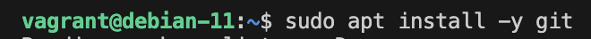
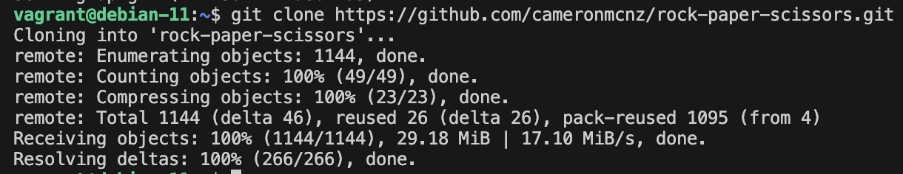
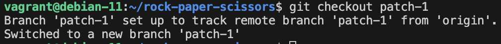
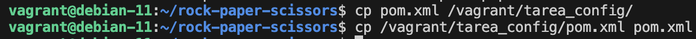
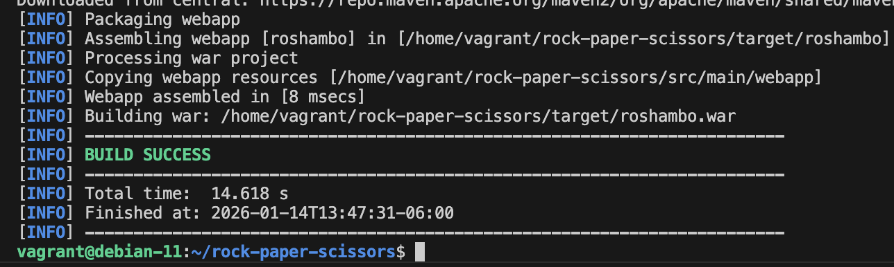
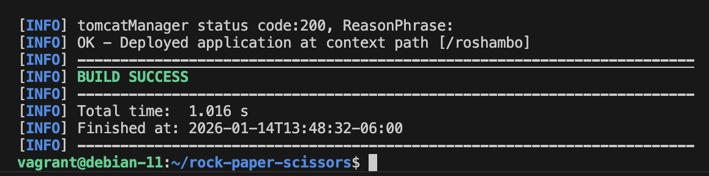
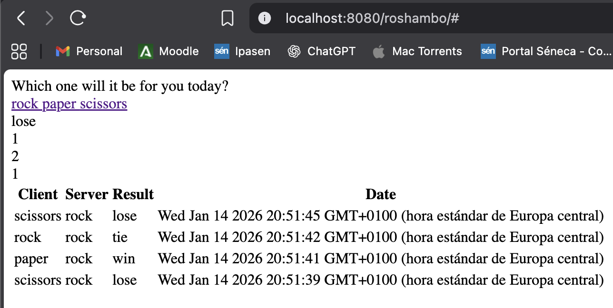

# Tomcat y Maven

**Autor:** Jorge Garre Corrales

He hecho todos los pasos previos configurando mi máquina Vagrant, ahora voy a hacer la práctica

Lo primero que he hecho ha sido instalar Git ya que no estaba instalado en la máquina y clonar el repositorio de la práctica

He cambiado a la rama del repositorio que pide la tarea

Despues he copiado el fichero pom.xml en tarea_config/ para poder editarlo desde VScode y le he añadido la siguiente configuración

He ejecutado mvn clean package y esta ha sido la salida

Despues he hecho mvn tomcat7:deploy y esta ha sido la salida

Y he accedido a través del navegador para comprobar que funciona

